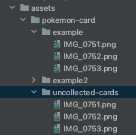
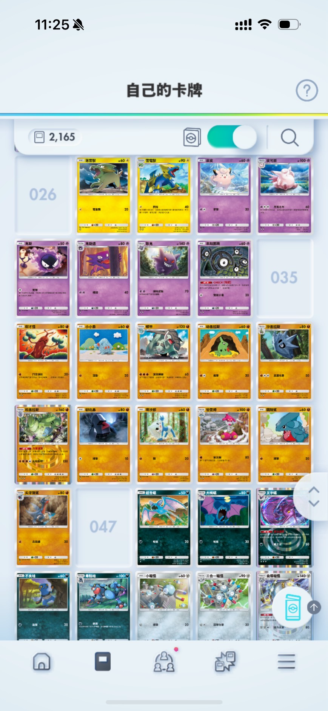
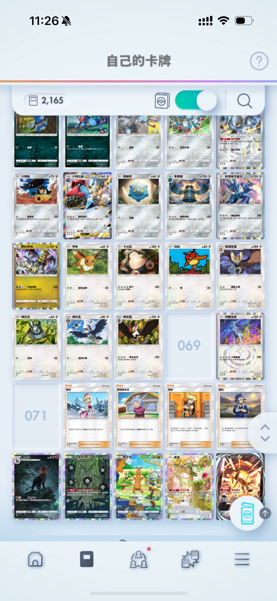

# 寶可夢卡牌工具

## 目的

以程式來協助管理寶可夢卡牌的工具，順便實作 `Golang` 相關的練習。

## 應用技能

- 網路爬蟲
  - 透過 `chromedp` 操作瀏覽器，爬取對應資料。
- 圖片切割
  - 透過 `gocv` 對圖片進行分析切割。
- AI 辨識服務
  - 串接 `Gmini` AI 服務，進行圖片辨識。
- 資料庫設計及控制
  - 基本 `MySql` 語句操作。
  - `Gorm` 操作運用。
  - 規劃一對多及中間表多對多關聯並應用。
- 環境變數整合及應用

## 功能

### 整理未收集卡牌

透過截圖的方式，識別圖片中的編號，抓取對應編號卡牌，可進一步思索抽卡包的策略。

#### 實作方式
- 透過網路爬蟲抓取卡牌資料。
- 分析寶可夢卡牌遊戲截圖，分析未收集卡牌。

#### 事前準備（抓取寶可夢卡牌資料）

- 建立 `.env`，並確認其中內容。

```shell
cp .env.example .env
```

```text
# --- Google API ---
GOOGLE_GMINI_API_KEY    = # 填寫 Google API Key
HAS_GMINI_API_PARSE_LOG = false # 是否紀錄 Gmini API 回傳 log

# --- 寶可夢工具 ---
UNCOLLECTED_CARD_SERIES = 1 # 卡牌系列：1. 時空激鬥 2. 超克之光
UNCOLLECTED_CARDS_DIR   = uncollected-cards # 未收集卡牌圖片資料夾
```

- 執行程式碼透過卡牌系列（1. 時間激鬥(預設)、2. 超克之光）爬蟲抓取資料。

```shell
go run updateCardData.go -series 1
```

#### 使用方式

- 將遊戲截圖放置於 `./assets/pokemon-card/uncollected-cards` 資料夾中。



- 確認 `.env` 設定。

- 執行程式碼。

```shell
go run main.go
```

#### 實際結果





Output:
```text
開始處理圖片： IMG_0751.png
開始處理圖片： IMG_0752.png
開始處理圖片： IMG_0753.png
處理完成，開始 AI 識別數字......
未收集卡牌： [003 010 022 026 035 047 069 071]
卡片編號：003, 卡片名稱：紳士蛾, 卡片屬性：草, 卡片稀有度：70pt, 擴充包：超克之光擴充包
卡片編號：010, 卡片名稱：葉伊布ex, 卡片屬性：草, 卡片稀有度：500pt, 擴充包：超克之光擴充包
卡片編號：022, 卡片名稱：冰伊布ex, 卡片屬性：水, 卡片稀有度：500pt, 擴充包：超克之光擴充包
卡片編號：026, 卡片名稱：雷丘, 卡片屬性：雷, 卡片稀有度：150pt, 擴充包：超克之光擴充包
卡片編號：035, 卡片名稱：洛托姆, 卡片屬性：超, 卡片稀有度：150pt, 擴充包：超克之光擴充包
卡片編號：047, 卡片名稱：烈咬陸鯊ex, 卡片屬性：鬥, 卡片稀有度：500pt, 擴充包：超克之光擴充包
卡片編號：069, 卡片名稱：謝米, 卡片屬性：無色, 卡片稀有度：150pt, 擴充包：超克之光擴充包
卡片編號：071, 卡片名稱：阿爾宙斯ex, 卡片屬性：無色, 卡片稀有度：500pt, 擴充包：超克之光擴充包
```
